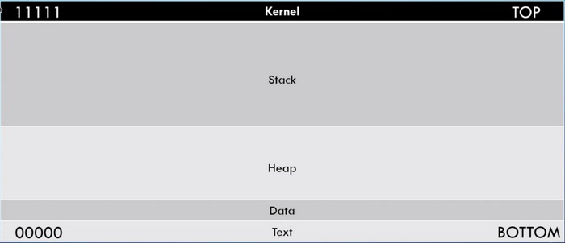
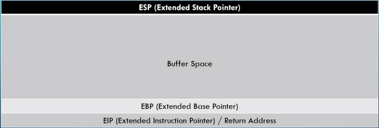

## Anatomy of memory :
Here we have a simplified explanation of how memory is managed.

We can say that kernel is on the bottom and text on top it does not really matter.

We're going to focus on the stack.

## Anatomy of the Stack

If the buffer space is sanitazed then whe can't overflow the buffer space.

If not we overflow to the EBP and EIP, and since the EIP hold address that allow us to run malicious code.

## Step to conduct a buffer overflow

1) Spinking => Find a vulnerable part of the program
2) Fuzzing => Send bunch of character and see if we break it
3) If broke we need to find the offset
4) If we have the offset we can try to overwrite the EIP
5) Now we need to find bad characters
6) Find the right module
7) Generate the shell code