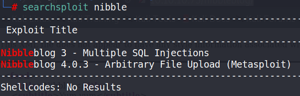
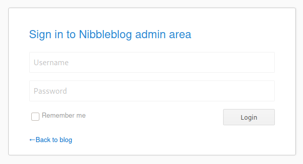

Type: #linux
Level: #easy 
Link: <https://app.hackthebox.eu/machines/Jerry>
Tags : #TCM
Tools: [[NMAP]] [[BURP]]	

## Pentesting of retired HTB VM Nibbles
### Following walkthrougt of TCM on udemy

Info : Linux 10.10.10.75

```
Starting Nmap 7.91 ( https://nmap.org ) at 2021-05-27 16:39 EDT
Nmap scan report for 10.10.10.75
Host is up (0.037s latency).
Not shown: 65533 closed ports
PORT   STATE SERVICE VERSION
22/tcp open  ssh     OpenSSH 7.2p2 Ubuntu 4ubuntu2.2 (Ubuntu Linux; protocol 2.0)
| ssh-hostkey: 
|   2048 c4:f8:ad:e8:f8:04:77:de:cf:15:0d:63:0a:18:7e:49 (RSA)
|   256 22:8f:b1:97:bf:0f:17:08:fc:7e:2c:8f:e9:77:3a:48 (ECDSA)
|_  256 e6:ac:27:a3:b5:a9:f1:12:3c:34:a5:5d:5b:eb:3d:e9 (ED25519)
80/tcp open  http    Apache httpd 2.4.18 ((Ubuntu))
|_http-server-header: Apache/2.4.18 (Ubuntu)
|_http-title: Site doesn't have a title (text/html).
No exact OS matches for host (If you know what OS is running on it, see https://nmap.org/submit/ ).
TCP/IP fingerprint:
OS:SCAN(V=7.91%E=4%D=5/27%OT=22%CT=1%CU=32830%PV=Y%DS=2%DC=T%G=Y%TM=60B003E
OS:4%P=x86_64-pc-linux-gnu)SEQ(SP=FA%GCD=1%ISR=109%TI=Z%CI=I%II=I%TS=8)OPS(
OS:O1=M54DST11NW7%O2=M54DST11NW7%O3=M54DNNT11NW7%O4=M54DST11NW7%O5=M54DST11
OS:NW7%O6=M54DST11)WIN(W1=7120%W2=7120%W3=7120%W4=7120%W5=7120%W6=7120)ECN(
OS:R=Y%DF=Y%T=40%W=7210%O=M54DNNSNW7%CC=Y%Q=)T1(R=Y%DF=Y%T=40%S=O%A=S+%F=AS
OS:%RD=0%Q=)T2(R=N)T3(R=N)T4(R=Y%DF=Y%T=40%W=0%S=A%A=Z%F=R%O=%RD=0%Q=)T5(R=
OS:Y%DF=Y%T=40%W=0%S=Z%A=S+%F=AR%O=%RD=0%Q=)T6(R=Y%DF=Y%T=40%W=0%S=A%A=Z%F=
OS:R%O=%RD=0%Q=)T7(R=Y%DF=Y%T=40%W=0%S=Z%A=S+%F=AR%O=%RD=0%Q=)U1(R=Y%DF=N%T
OS:=40%IPL=164%UN=0%RIPL=G%RID=G%RIPCK=G%RUCK=G%RUD=G)IE(R=Y%DFI=N%T=40%CD=
OS:S)

Network Distance: 2 hops
Service Info: OS: Linux; CPE: cpe:/o:linux:linux_kernel
```
Open ports : `22 80`

Webpage on :80 is a simple hello world text.

Source analyses give us a path to a blog http://10.10.10.75/nibbleblog/ 

searchsploit list some exploit for this specific cms :


The second one seems a bit more interesting.

According to the description it is necessary to be authenticated on the app, luckely a classic /admin.php give us a login page



Dirbuster show some interesting file but following the walktrough from TCM I got the admin and password directly

Once in with the login/passwd combo I've executed metasploit with the exploit for the 4.0.3 version or Nibbleblog.

This allowed me to access the machine with the nibble user.

With the nibble user i'm allowed to sudo a .sh file (found by using sudo -l)

Sadly it's hard to write a file via the shell from metasploit.

So i created a monitor.sh file with "bash -i" indose. on a directory in my kali vm, run up a simpleHTTP server with python
Then from the box I wget the file and executed it with sudo and the full path.

This gave me the root access and I can retreive the root flag