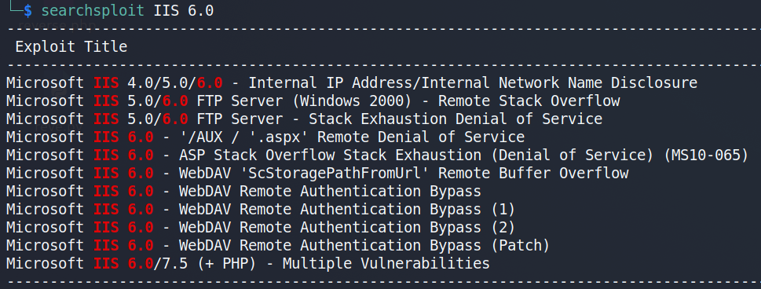

Type: #window<br>
Level: #easy<br>
Link: <https://www.hackthebox.eu/machines/Grandpa><br>
Tags : #TCM<br>
Tools: 

## Pentesting of retired HTB VM 

### Scanning
```
Nmap scan report for 10.10.10.14
Host is up (0.041s latency).
Not shown: 65534 filtered ports
PORT   STATE SERVICE VERSION
80/tcp open  http    Microsoft IIS httpd 6.0
| http-methods: 
|_  Potentially risky methods: TRACE COPY PROPFIND SEARCH LOCK UNLOCK DELETE PUT MOVE MKCOL PROPPATCH
|_http-server-header: Microsoft-IIS/6.0
|_http-title: Under Construction
| http-webdav-scan: 
|   Server Date: Sun, 06 Jun 2021 16:13:29 GMT
|   WebDAV type: Unknown
|   Allowed Methods: OPTIONS, TRACE, GET, HEAD, COPY, PROPFIND, SEARCH, LOCK, UNLOCK
|   Server Type: Microsoft-IIS/6.0
|_  Public Options: OPTIONS, TRACE, GET, HEAD, DELETE, PUT, POST, COPY, MOVE, MKCOL, PROPFIND, PROPPATCH, LOCK, UNLOCK, SEARCH
Warning: OSScan results may be unreliable because we could not find at least 1 open and 1 closed port
Device type: general purpose
Running (JUST GUESSING): Microsoft Windows 2003|2008|XP|2000 (92%)
OS CPE: cpe:/o:microsoft:windows_server_2003::sp1 cpe:/o:microsoft:windows_server_2003::sp2 cpe:/o:microsoft:windows_server_2008::sp2 cpe:/o:microsoft:windows_xp::sp3 cpe:/o:microsoft:windows_2000::sp4
Aggressive OS guesses: Microsoft Windows Server 2003 SP1 or SP2 (92%), Microsoft Windows Server 2008 Enterprise SP2 (92%), Microsoft Windows Server 2003 SP2 (91%), Microsoft Windows 2003 SP2 (91%), Microsoft Windows XP SP3 (90%), Microsoft Windows 2000 SP4 or Windows XP Professional SP1 (90%), Microsoft Windows XP (87%), Microsoft Windows Server 2003 SP1 - SP2 (86%), Microsoft Windows XP SP2 or Windows Server 2003 (86%), Microsoft Windows 2000 SP4 (85%)
No exact OS matches for host (test conditions non-ideal).
Network Distance: 2 hops
Service Info: OS: Windows; CPE: cpe:/o:microsoft:windows
```

###  Enumeration
Info disclosure : IIS 6.0 using webdav with default page and probably a server < WS 2012

Searchsploit gave us multiple potential exploit :  



### Exploitation

Executing the Metasploit module iis\_webdav\_scstoragepathfromurl immediately grants a shell.Executing the Metasploit module iis_webdav_scstoragepathfromurl immediately grants a shell.

Then I migrate a process to get a session and use the following priv esc to go root :

`windows/local/ms14_070_tcpip_ioctl`