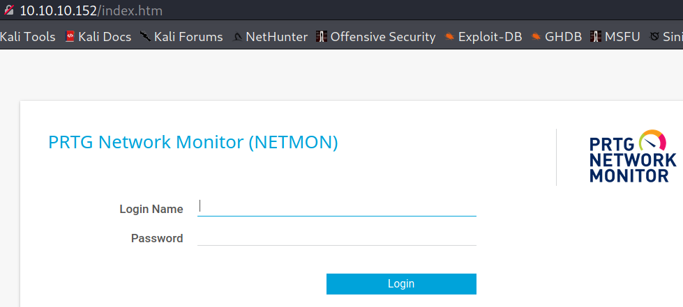

Type: #windows<br>
Level: #easy<br>
Link: <https://www.hackthebox.eu/machines/Netmon><br>
Tags : #TCM<br>
Tools: 

## Pentesting of retired HTB VM Netmon

### Scanning
```bash
Starting Nmap 7.91 ( https://nmap.org ) at 2021-06-29 09:37 EDT
Nmap scan report for 10.10.10.152
Host is up (0.037s latency).
Not shown: 65523 closed ports
PORT      STATE SERVICE      VERSION
21/tcp    open  ftp          Microsoft ftpd
| ftp-anon: Anonymous FTP login allowed (FTP code 230)
| 02-03-19  12:18AM                 1024 .rnd
| 02-25-19  10:15PM       <DIR>          inetpub
| 07-16-16  09:18AM       <DIR>          PerfLogs
| 02-25-19  10:56PM       <DIR>          Program Files
| 02-03-19  12:28AM       <DIR>          Program Files (x86)
| 02-03-19  08:08AM       <DIR>          Users
|_02-25-19  11:49PM       <DIR>          Windows
| ftp-syst: 
|_  SYST: Windows_NT
135/tcp   open  msrpc        Microsoft Windows RPC
139/tcp   open  netbios-ssn  Microsoft Windows netbios-ssn
445/tcp   open  microsoft-ds Microsoft Windows Server 2008 R2 - 2012 microsoft-ds
5985/tcp  open  http         Microsoft HTTPAPI httpd 2.0 (SSDP/UPnP)
|_http-server-header: Microsoft-HTTPAPI/2.0
|_http-title: Not Found
47001/tcp open  http         Microsoft HTTPAPI httpd 2.0 (SSDP/UPnP)
|_http-server-header: Microsoft-HTTPAPI/2.0
|_http-title: Not Found
49664/tcp open  msrpc        Microsoft Windows RPC
49665/tcp open  msrpc        Microsoft Windows RPC
49666/tcp open  msrpc        Microsoft Windows RPC
49667/tcp open  msrpc        Microsoft Windows RPC
49668/tcp open  msrpc        Microsoft Windows RPC
49669/tcp open  msrpc        Microsoft Windows RPC
No exact OS matches for host (If you know what OS is running on it, see https://nmap.org/submit/ ).
TCP/IP fingerprint:
OS:SCAN(V=7.91%E=4%D=6/29%OT=21%CT=1%CU=44585%PV=Y%DS=2%DC=T%G=Y%TM=60DB22E
OS:3%P=x86_64-pc-linux-gnu)SEQ(SP=106%GCD=1%ISR=10C%TI=I%CI=I%II=I%SS=S%TS=
OS:A)OPS(O1=M54DNW8ST11%O2=M54DNW8ST11%O3=M54DNW8NNT11%O4=M54DNW8ST11%O5=M5
OS:4DNW8ST11%O6=M54DST11)WIN(W1=2000%W2=2000%W3=2000%W4=2000%W5=2000%W6=200
OS:0)ECN(R=Y%DF=Y%T=80%W=2000%O=M54DNW8NNS%CC=Y%Q=)T1(R=Y%DF=Y%T=80%S=O%A=S
OS:+%F=AS%RD=0%Q=)T2(R=Y%DF=Y%T=80%W=0%S=Z%A=S%F=AR%O=%RD=0%Q=)T3(R=Y%DF=Y%
OS:T=80%W=0%S=Z%A=O%F=AR%O=%RD=0%Q=)T4(R=Y%DF=Y%T=80%W=0%S=A%A=O%F=R%O=%RD=
OS:0%Q=)T5(R=Y%DF=Y%T=80%W=0%S=Z%A=S+%F=AR%O=%RD=0%Q=)T6(R=Y%DF=Y%T=80%W=0%
OS:S=A%A=O%F=R%O=%RD=0%Q=)T7(R=Y%DF=Y%T=80%W=0%S=Z%A=S+%F=AR%O=%RD=0%Q=)U1(
OS:R=Y%DF=N%T=80%IPL=164%UN=0%RIPL=G%RID=G%RIPCK=G%RUCK=G%RUD=G)IE(R=Y%DFI=
OS:N%T=80%CD=Z)

Network Distance: 2 hops
Service Info: OSs: Windows, Windows Server 2008 R2 - 2012; CPE: cpe:/o:microsoft:windows

Host script results:
|_clock-skew: mean: 1m36s, deviation: 0s, median: 1m35s
| smb-security-mode: 
|   account_used: guest
|   authentication_level: user
|   challenge_response: supported
|_  message_signing: disabled (dangerous, but default)
| smb2-security-mode: 
|   2.02: 
|_    Message signing enabled but not required
| smb2-time: 
|   date: 2021-06-29T13:42:21
|_  start_date: 2021-06-29T13:39:17

TRACEROUTE (using port 5900/tcp)
HOP RTT      ADDRESS
1   35.73 ms 10.10.14.1
2   35.10 ms 10.10.10.152

OS and Service detection performed. Please report any incorrect results at https://nmap.org/submit/ .
Nmap done: 1 IP address (1 host up) scanned in 175.79 seconds
```
###  Enumeration

From what I can see we have a FTP port open but it likely is a rabbit hole, IMO I should go for an RPC exploit following by a priv esc using HTTPAPI.

Port 80 is also open (but not show in the scan) we have a PRTG Network Monitor web login :



This might also be the entry door


### Exploitation
RESULT : Following the walktrough of TCM cuz I still suck really bad at this turns out going to port 21 was the first step.

So via FTP I got the config files of PRTG and one of them had the password in plaintext.

Using the cookie of this account we can use the following exploit : https://www.exploit-db.com/exploits/46527


This create an admin user on the machine