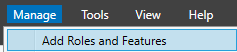
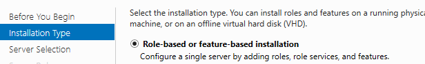
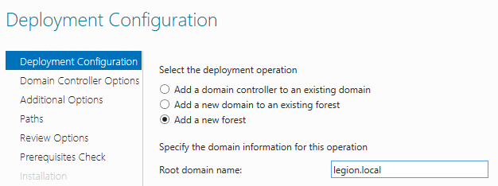
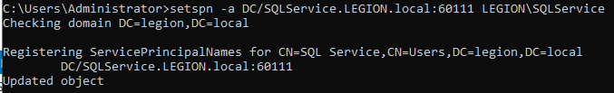
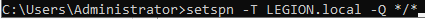

# Building the domain controller

 

- Only select ADDS
- Next everything until install

## Promoting to DC

- 

- Only next until Prerequisites check

### Setting GPO and Users

Users list :

| Account       | Password       |
|---------------|----------------|
| fcastle       | Password1      |
| tstark        | Password1!     |
| pparker       | Password2      |
| SQLService    | Mypassword123! |
| Administrator | P@$$w0rd!      |

### SPN Creation

